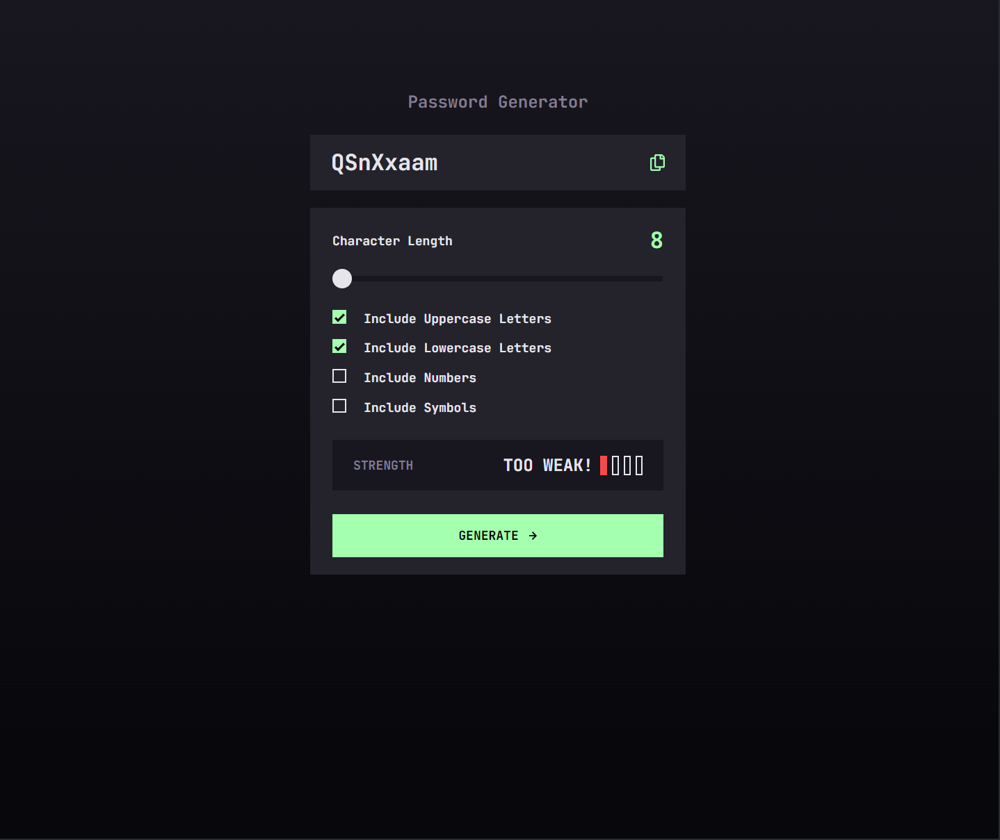
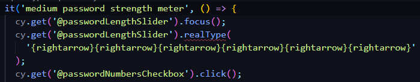

# Password Generator Web-Application

Project provided by [FrontEndMentors](https://www.frontendmentor.io/challenges/password-generator-app-Mr8CLycqjh). Desing and main requirement provided thanks to FrontEndMentor.

The requirement of the project is to create a simple password generator where a user can adjust the length and characters of the password, and copy the password to the clipboard as well.

## Techstack Used

Project was bootstrapped with [Vite](https://vitejs.dev/guide/) using the the React/Typescript template. [Eslint](https://eslint.org/) lint used with react, prettier, and cypress rules.

- [React](https://reactjs.org/docs/getting-started.html) (Front end framework/library)
- [Cypress](https://docs.cypress.io/guides/overview/why-cypress) (End-to-end testing)
- [React Hook Form](https://react-hook-form.com/) (Manage state of html forms and handle form submission)
- [CSS Modules](https://github.com/css-modules/css-modules) (Style the application)
- [generate-password-browser](https://www.npmjs.com/package/generate-password-browser)(Generate random passwords based on options passed in)

## Developemnt Process

With this project, I wanted to look into trying new ways to tackle differnet problems. Usually for forms I use [Formik](https://formik.org/), but this time I wanted to use react-hook-form since I had heard such great things and how it was easier to use compared to formik.

I also usually use [styled-components](https://styled-components.com/), but this time I wanted to use CSS modules since it looks really simple, and this scale of this project would allow me to get a great first experience using this tool.

Testing is an important process to me, so writing my test first in Cypress and then developing the application has improved my output in this project and other projects as well. Some unit testing was used as well for checking the password score function, using [Vitest](https://vitest.dev/), but the main goal here was end-to-end testing.

## Struggles

#### Generating Password

One of the first things I tried to do with this project was create my own implementation of a random password generating function. The general idea of the function would work like this:

1. Function takes in password length, and variuos boolean values reprsenting a password option (useUppercase, useLowercase, useNumbers, useBooleans)
2. Create a string that represents a bank of words, initally blank.
3. Based on the boolean values, insert a set of characters into this bank. For example, if "useUppercase" was true, insert uppercase letters from A to Z into this bank, if 'userNumbers" was true, then insert numbers 0 to 9 into the bank.
4. Create a loop based on the password length value passed in, for each iteration, using the JavaScript [Crypto.getRandomValues](https://developer.mozilla.org/en-US/docs/Web/API/Crypto/getRandomValues), get random values from this word bank and insert each character into a new array.
5. Use the JavaScript [array join method](https://developer.mozilla.org/en-US/docs/Web/JavaScript/Reference/Global_Objects/Array/join) to turn the arra into one string, and return it.

The main problem of this implementation was that randomly, the function would just hang, not returning any results or throwing an error. I believe this may have been due to me implementing a while loop after generating a password to ensure that the password met the criteria based on the rules applied. So if the password did not meet the critera, then it would attempt to re-generate the password, and this is where it would begin to hang.

I didn't want to get stuck on this for very long, so this lead me to search through the npm registry and look for a package that could help me. This is when I found the **generate-password-browser** and found it to meet my needs.

#### Testing input range slider

While testing in cypress, I found that changing the range slider would not work properly, what was happening was that since I was directly invoking the range slider and changing its value. So though in the dev tools the input did have the changed value, this was not being picked up by React, and thus a re-render to update the value in the state was not occuring.

Eventually I found a package that with cypress, would one to type a "right arrow" on the slider, moving the knob to the right, and firing off the react re-render. As of now, eslint does not pick up the cypress command and thus we are getting a linting error, but the with this I was able to move the range slider properly and have all test pass.

## How to improve/What to fix

#### Create own implementation of Password Generator

Create my own implementation of generating a random password, the generate-password-browser package works great, but at some point I would like to attempt my own implementation.
